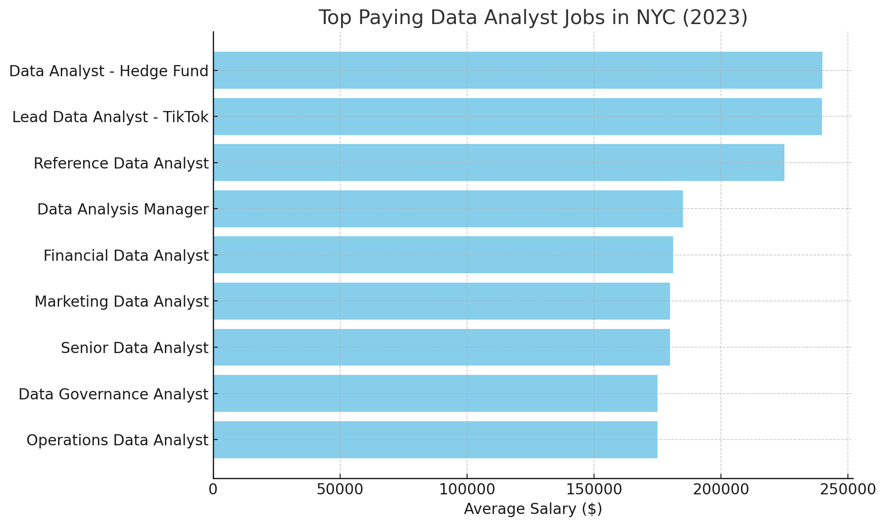
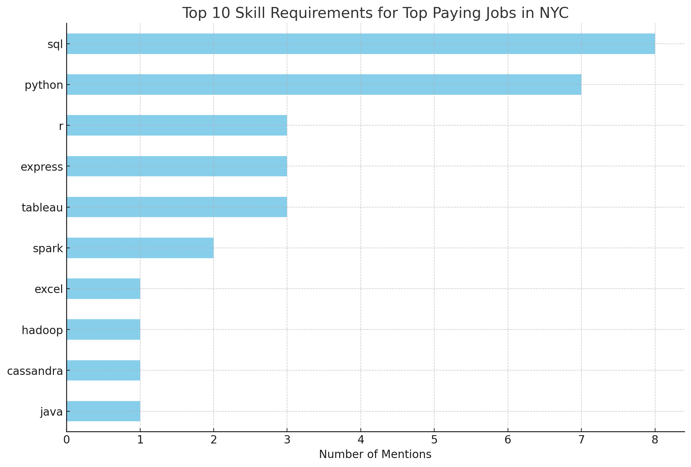

# Introduction
This is the final project of Luke Barousse's SQL for Data Analytics course on YouTube. In this project, I explore the 2023 data job market, focusing specifically on New York City. The project centers on data analyst roles, highlighting the highest-paying jobs, the most sought-after skills, and the best skills to learn that are both in high demand and offer high salaries.

🔍 SQL queries? Check them out here: [project_sql folder](/project_sql/)

# Background
As someone transitioning from impact investing to data analytics, I aim to better understand the data analyst job market. This project identifies top-paying and in-demand skills, making it easier for me and other aspiring data professionals to find ideal positions.

The data, sourced from [Luke Barousse's SQL Course](https://lukebarousse.com/sql), provides valuable insights on job titles, salaries, locations, and key skills.

### The questions I wanted to answer through my SQL queries were:

1. What are the top-paying data analyst jobs?
2. What skills are required for these top-paying jobs?
3. What skills are most in demand for data analysts?
4. Which skills are associated with higher salaries?
5. What are the most optimal skills to learn?

# Tools I Used
For my deep dive into the data analyst job market, I harnessed the power of several key tools:

- **SQL:** The backbone of my analysis, allowing me to query the database and unearth critical insights.
- **PostgreSQL:** The chosen database management system, ideal for handling the job posting data.
- **Visual Studio Code:** My go-to for database management and executing SQL queries.
- **Git & GitHub:** Essential for version control and sharing my SQL scripts and analysis, ensuring collaboration and project tracking.
- **ChatGPT Data Analytics:** streamlining the production of data analytics insights and graphics

# The Analysis
Each query for this project aimed at investigating specific aspects of the data analyst job market. Here’s how I approached each question:

### 1. Top Paying Data Analyst Jobs
To identify the highest-paying roles, I filtered data analyst positions by average yearly salary and location, focusing on New York City jobs. This query highlights the high paying opportunities in the field.

```sql
SELECT
    job_title,
    company_dim.name AS company_name,
    salary_year_avg,
    job_schedule_type
FROM job_postings_fact
LEFT JOIN company_dim 
    ON company_dim.company_id = job_postings_fact.company_id
WHERE
    job_title_short = 'Data Analyst' AND
    job_location = 'New York, NY' AND
    salary_year_avg IS NOT NULL
ORDER BY
    salary_year_avg DESC
LIMIT 10
```
Here's the breakdown of the top data analyst jobs in 2023:
- The top 10 paying data analyst roles salary for top-paying data analyst jobs in NYC for 2023 is approximately $202,073, ranging from $175,000 to $240,000.
- The highest-paying position is the Data Sector Analyst at Coda Search│Staffing, with a salary of $240,000.
- Companies like Coda TikTok, Selby Jenning, and Pronix Inc are among those offering high salaries, showing a broad interest across different industries.


*Bar graph visualizing the salaries for top-paying data analyst jobs in NYC for 2023; ChatGPT generated this graph from my SQL query results*

### 2. Skills for Top Paying Jobs
To understand what skills are required for the top-paying jobs, I joined the job postings with the skills data, providing insights into what employers value for high-compensation roles.
```sql
WITH top_10_paying_job AS(
    SELECT
        job_id,
        job_title,
        company_dim.name AS company_name,
        salary_year_avg,
        job_schedule_type,
        job_location
    FROM job_postings_fact
    LEFT JOIN company_dim 
        ON company_dim.company_id = job_postings_fact.company_id
    WHERE
        job_title_short = 'Data Analyst' AND
        job_location = 'New York, NY' AND
        salary_year_avg IS NOT NULL
    ORDER BY
        salary_year_avg DESC
    LIMIT 10
)

SELECT 
    top_10_paying_job.*,
    skills
FROM skills_dim
INNER JOIN skills_job_dim ON skills_job_dim.skill_id = skills_dim.skill_id
INNER JOIN top_10_paying_job ON top_10_paying_job.job_id = skills_job_dim.job_id
ORDER BY
    salary_year_avg DESC
```
Here's the breakdown of the most demanded skills for the top 10 highest paying data analyst jobs in 2023:
- **SQL:** Mentioned 8 times, SQL is crucial for data management, querying, and manipulation.
- **Python:** Mentioned 7 times, Python is essential for data analysis, machine learning, scripting, and automation.
- **R, Express, and Tableau:** Mentioned 3 times each, R is significant for statistical analysis and data visualization, Express is important for backend web development, and Tableau is used for data visualization and business intelligence.
Other less in-demand skills incldue **Spark**, **Excel**, **Hadoop**, and **Cassandra**.


*Bar graph visualizing the count of skills for the top 10 paying jobs for data analysts; ChatGPT generated this graph from my SQL query results*

### 3. In-Demand Skills for Data Analysts

This query helped identify the skills most frequently requested in job postings, directing focus to areas with high demand.

```sql
SELECT
    skills_dim.skills,
    COUNT(*) AS job_count
FROM job_postings_fact
INNER JOIN skills_job_dim ON skills_job_dim.job_id = job_postings_fact.job_id
INNER JOIN skills_dim ON skills_dim.skill_id = skills_job_dim.skill_id
WHERE 
    job_title_short = 'Data Analyst' AND 
    job_location = 'New York, NY'
GROUP BY skills_dim.skills 
ORDER BY job_count DESC
Limit 5
```
Here's the breakdown of the most demanded skills for data analysts in NYC for 2023
- SQL is the most frequently requested skill, with 1,695 job postings requiring it. This indicates a high demand for professionals proficient in SQL.
- Excel and Python are also highly sought after, with 1,294 and 988 job postings, respectively. This highlights the significant value placed on data analysis and programming skills in the job market.

| Skills  | Job Count |
|:--------|----------:|
| SQL     | 1695      |
| Excel   | 1294      |
| Python  | 988       |
| Tableau | 968       |
| R       | 565       |
*Table of the demand for the top 5 skills in data analyst job postings*

### 4. Skills Based on Salary
Exploring the average salaries associated with different skills revealed which skills are the highest paying.
```sql
SELECT
    skills_dim.skills,
    ROUND(AVG(salary_year_avg), 2) AS avg_salary 
FROM job_postings_fact 
INNER JOIN skills_job_dim ON skills_job_dim.job_id = job_postings_fact.job_id
INNER JOIN skills_dim ON skills_dim.skill_id = skills_job_dim.skill_id
WHERE 
    job_title_short = 'Data Analyst' AND 
    salary_year_avg IS NOT NULL AND 
    job_location = 'New York, NY'
GROUP BY skills_dim.skills 
ORDER BY avg_salary DESC
Limit 10
```
Here's a breakdown of the results for top paying skills for Data Analysts:
- The highest average salaries are associated with skills in Elasticsearch and Neo4j, both offering an average salary of $185,000.
- Skills in database technologies like Cassandra and Neo4j are among the top-paying, indicating high demand and value for expertise in these areas.
- The list includes a mix of specialized database skills (e.g., Cassandra, Neo4j), data manipulation tools (e.g., dplyr), and operating system knowledge (e.g., Unix), showing that a variety of technical skills can lead to high salaries. ​

| Skills        | Average Salary |
|:--------------|----------------:|
| Elasticsearch | $185,000        |
| Neo4j         | $185,000        |
| Cassandra     | $175,000        |
| dplyr         | $167,500        |
| Unix          | $162,500        |
| Perl          | $157,000        |
| Twilio        | $150,000        |
| Spring        | $147,500        |
| C             | $146,500        |
| Angular       | $138,516        |

*Table of the average salary for the top 10 paying skills for data analysts*

### 5. Most Optimal Skills to Learn

Combining insights from demand and salary data, this query aimed to pinpoint skills that are both in high demand and have high salaries, offering a strategic focus for skill development.

```sql
SELECT
    skills_dim.skills,
    COUNT(*) AS job_count,
    ROUND(AVG(salary_year_avg), 2) AS avg_salary 
FROM job_postings_fact 
INNER JOIN skills_job_dim ON skills_job_dim.job_id = job_postings_fact.job_id
INNER JOIN skills_dim ON skills_dim.skill_id = skills_job_dim.skill_id
WHERE 
    job_title_short = 'Data Analyst' AND 
    salary_year_avg IS NOT NULL AND
    job_location = 'New York, NY'
GROUP BY skills_dim.skills 
HAVING COUNT(*) > 23
ORDER BY 
    avg_salary DESC,
    job_count DESC
Limit 10
```
Here's a breakdown of the most optimal skills for Data Analysts in NYC for 2023: 
- **High Salary Skills:** The skill with the highest average salary is "Python," with an average salary of $110,395.54, followed closely by "SQL" at $104,757.08.
- **High Demand Skills:** The most in-demand skill is "SQL," with 206 job postings, followed by "Excel" with 140 job postings.
- **High Demand and High Salary Skills**: Skills like "Tableau" and "R" are noteworthy as they are both in high demand and offer high salaries.
- **Strategic Skill Focus:** For strategic skill development, focusing on skills such as "Python," "SQL," and "Tableau" could be beneficial, as they balance both demand and high salary prospects effectively.

| Skills      | Job Count | Average Salary |
|-------------|------------|----------------|
| Python      | 126        | $110,395.54    |
| SQL         | 206        | $104,757.08    |
| Tableau     | 116        | $100,029.62    |
| PowerPoint  | 41         | $98,164.88     |
| R           | 71         | $96,082.98     |
| Power BI    | 40         | $95,998.82     |
| Go          | 24         | $95,667.11     |
| Excel       | 140        | $92,450.12     |
| Word        | 35         | $91,649.53     |
| SAS         | 40         | $82,009.60     |
*Table of the most optimal skills for data analyst sorted by salary*

# What I Learned

Throughout this adventure, I've turbocharged my SQL toolkit with some serious firepower:
1. **Importance of Market Analysis:** The exercise highlighted the need for skills in analyzing market demand and salary data, which are crucial for making strategic decisions regarding skill development and career focus.
2. **Complex Query Crafting:** Mastered and applied advanced SQL techniques to real-world data analytical problems, efficiently merging tables and utilizing WITH clauses for temporary table operations.
3. **Data Aggregation:** Became proficient with GROUP BY, effectively utilizing aggregate functions like COUNT() and AVG() to summarize data.
4. **Data Interpretation**: Proficiency in interpreting and extracting meaningful insights from data is essential. This involves understanding various metrics like job counts and average salaries to identify trends and make informed decisions.
5. **Data Presentation:** The ability to present data in a clear and structured format, such as using markdown tables, is vital for effective communication, ensuring that complex data can be easily understood by different stakeholders.

# Conclusions

1. **Highest-Paying Data Analyst Positions:** In New York City, the top-paying data analyst roles offer salaries up to $240,000.
2. **Essential Skills for High Salaries:** Advanced proficiency in SQL is crucial for securing high-paying data analyst jobs, underscoring its importance in achieving top salaries.
3. **Most In-Demand Skill:** SQL is the most sought-after skill in the data analyst job market, making it essential for job seekers.
4. **Specialized Skills with Premium Salaries:** Niche skills like Elasticsearch and Neo4j are linked with the highest average salaries in NYC, highlighting the value of specialized expertise.
5. **Optimal Skills for Market Value:** Python and SQL are highly demanded and associated with high average salaries, making them key skills for data analysts aiming to maximize their market value.

